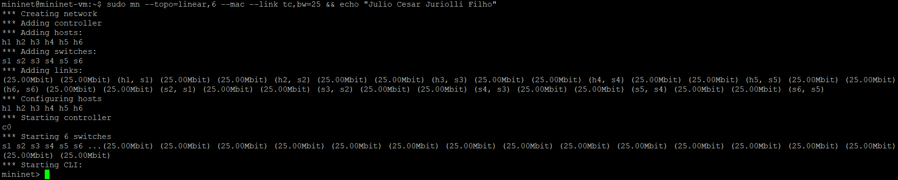
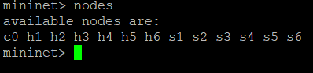
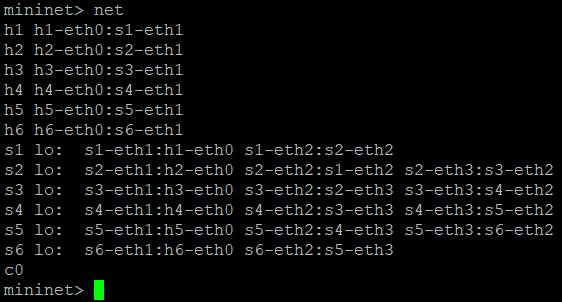
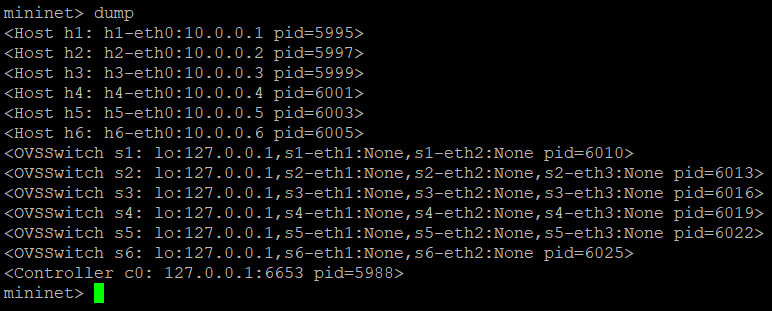
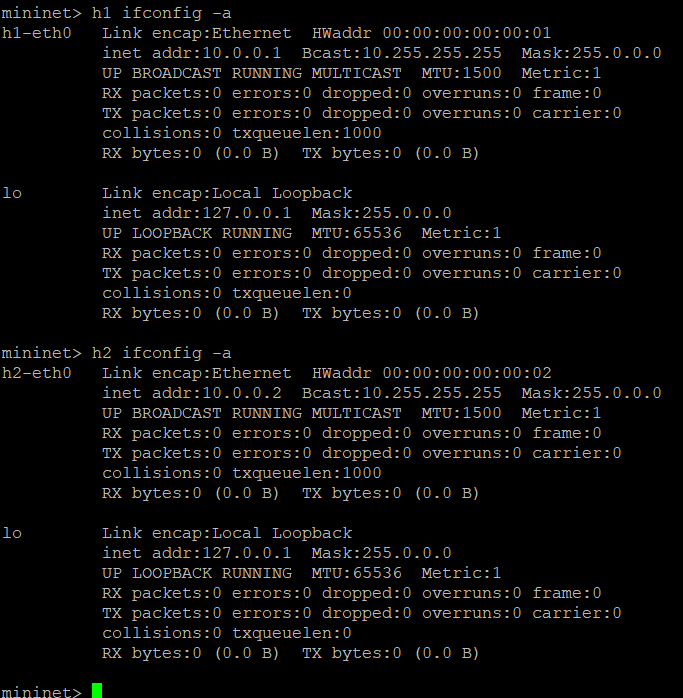
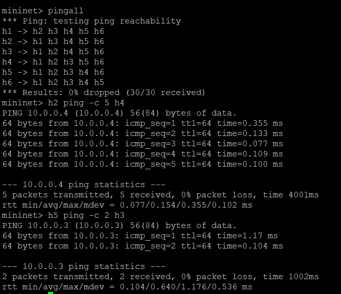
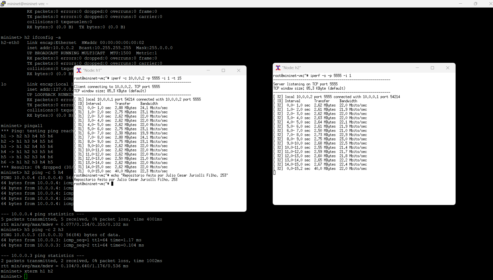

# Introdução ao mininet
| Esse repositorio tem objtivo de descrever o trabalho de mininet, proposto na disciplina de C115

### Requisitos:
Conforme orientado pelo professor, os requisitos pra executar são:
- Putty
- Xterm
- VM que o professor disponibilizou

## 1. Criação da topologia
Para criar a topologia proposta, é necessário executar o seguinte comando, via putty:

```
sudo mn --topo=linear,6 --mac --link tc,bw=25
```

1. --topo=linear,6 -> descreve a topologia que queremos (6 switch)
2. --mac -> relacionado a orientação de ter um MAC padronizado
3. --link tc,bw=25 -> bandwidth de 25Mbps

### Resultado do comando:



## 2. Inspecionando a rede
Aqui vamos executar os comandos `nodes` , `net` , `dump` e `ifconfig`

- nodes: mostra os nós da rede
- net: quais portas conectam e os links
- dump: informação IP e MAC de cada nó
- ifconfig: detalhes da interce de cada nó

  





## 3. Testes de ping

- pingall pra realizar um teste de ping de toda a rede
- testes isolados de ping, de nó pra nó
- 



## 4. Teste de banda com iPerf

Para verificar a largura de banda efetiva usar o iPerf
 teste foi realizado entre os nós h1 (cliente) e h2 (servidor).

1. Abrir dois terminais XTerm, um para cada nó:
   ```xterm h1 h2```
2. Servidor:
   ```iperf -s -p 5555 -i 1```
3. Cliente:
   ```iperf -c 10.0.0.2 -p 5555 -i 1 -t 15```

O servidor fica escutando enquanto o servidor manda as requisições TCP, utilizando a porta 5555. Especificamos 15 como a quantidade de testes mandada para o servidor

